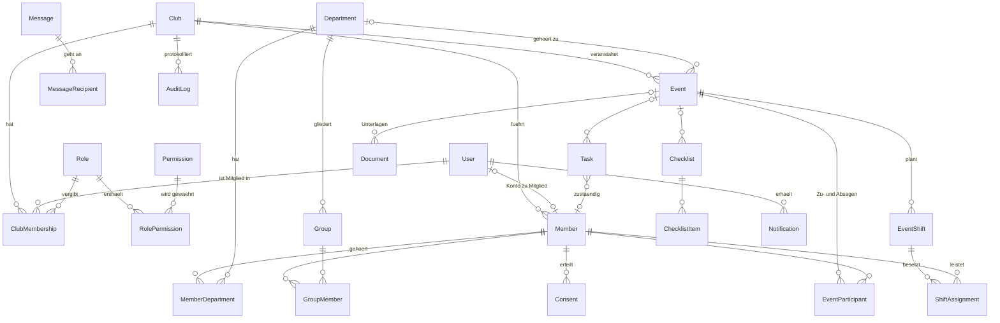

# Datenmodell

Maßgeblich ist [`prisma/schema.prisma`](../prisma/schema.prisma) (mit Erläuterungen im Kopf der Datei) und die SQL-Migrationen in
[`prisma/migrations`](../prisma/migrations), die Prüfregeln und Trigger enthalten, die sich im Schema nicht ausdrücken lassen.

## Konventionen

- **Mandant = Verein (`Club`).** Jede mandantenbezogene Tabelle trägt `clubId`. Beziehungen zwischen ihnen sind
  **zusammengesetzte Fremdschlüssel** `(clubId, id)` – die Datenbank verhindert, dass Zeilen zweier Vereine verknüpft werden.
- **Globale Tabellen** ohne `clubId`: `User`, `Session`, `VerificationToken`, `RateLimitBucket`, `DeletionRequest`, `Permission` (Katalog).
- **IDs:** UUIDv7 (zeitlich sortierbar, nicht erratbar). **Zeitpunkte:** `timestamptz`, UTC. **Kalendertage:** `@db.Date`.
- **Weiches Löschen:** `deletedAt` (Papierkorb), **Archivieren:** `archivedAt`. Endgültig entfernt bzw. anonymisiert die
  Aufbewahrungsroutine nach den Fristen des Vereins.
- Felder `…ById` ohne Fremdschlüssel sind reine Herkunftsangaben (Wer hat das angelegt?). So lässt sich ein Benutzerkonto
  datenschutzgerecht entfernen, ohne Fachdaten zu zerstören.

## Überblick

## Modelle nach Bereich

### Plattform (ohne Verein)

| Modell              | Zweck                                                                                                                                                                                     |
| ------------------- | ----------------------------------------------------------------------------------------------------------------------------------------------------------------------------------------- |
| `User`              | Konto: E-Mail (klein geschrieben, per CHECK), Argon2id-Hash, Plattform-Administrator-Kennzeichen, Vorbereitung für Zwei-Faktor (`totpSecretEnc`, `totpEnabledAt`), Datenschutz-Zustimmung |
| `Session`           | Sitzung: `id` ist der **Hash** des Tokens; Erstellung, letzte Aktivität, Ablauf, Gerät (gekürzt), IP-Präfix                                                                               |
| `VerificationToken` | Einmal-Token für E-Mail-Bestätigung, Passwort-Reset (nur als Hash)                                                                                                                        |
| `RateLimitBucket`   | Zähler für Anmelde- und andere Begrenzungen (Rate-Limit in PostgreSQL)                                                                                                                    |
| `DeletionRequest`   | Löschantrag einer Person (Bedenkzeit, Status, Nachweis ohne Klarnamen)                                                                                                                    |
| `Permission`        | Katalog aller Rechte (wird aus dem Code gepflegt, schreibgeschützt)                                                                                                                       |

### Verein, Rollen, Benutzer

| Modell           | Zweck                                                                                                                                                                                   |
| ---------------- | --------------------------------------------------------------------------------------------------------------------------------------------------------------------------------------- |
| `Club`           | Der Mandant: Name, Kennung (`slug`), Status, Einstellungen (JSON, u. a. Aufbewahrungsfristen), Kontaktdaten, Vereinslogo (`logo*`: Speicherschlüssel, Typ, Größe, Prüfsumme, Zeitpunkt) |
| `Role`           | Rolle eines Vereins (Standardrollen und – vorbereitet – eigene)                                                                                                                         |
| `RolePermission` | Recht einer Rolle **mit Reichweite** (`CLUB`, `DEPARTMENT`, `OWN`)                                                                                                                      |
| `ClubMembership` | Verbindet Benutzer, Verein und Rolle; Status (aktiv/gesperrt)                                                                                                                           |
| `Invitation`     | Einladung per Link (Token als Hash), höchstens eine offene je E-Mail und Verein                                                                                                         |

### Mitglieder

| Modell                 | Zweck                                                                                                                                                                                   |
| ---------------------- | --------------------------------------------------------------------------------------------------------------------------------------------------------------------------------------- |
| `Member`               | Stammdaten (Name, Kontakt, Adresse, Geburtsdatum, Status, Ein-/Austritt, interne Notizen, Funktion im Verein); optional mit `User` verknüpft; `archivedAt`, `deletedAt`, `anonymizedAt` |
| `Department`           | Abteilung (Farbe, Beschreibung)                                                                                                                                                         |
| `MemberDepartment`     | Zugehörigkeit eines Mitglieds zu einer Abteilung, mit Kennzeichen „Leitung“                                                                                                             |
| `Group`, `GroupMember` | Gruppen innerhalb einer Abteilung (z. B. Mannschaften)                                                                                                                                  |
| `Consent`              | Einwilligung als **Ereignisfolge** (erteilt/widerrufen, Zeitpunkt, Quelle, wer) – nie überschrieben                                                                                     |

### Veranstaltungen und Helfer

| Modell             | Zweck                                                                                                                                      |
| ------------------ | ------------------------------------------------------------------------------------------------------------------------------------------ |
| `Event`            | Veranstaltung: Art, Status, Sichtbarkeit, Zeitraum, Ort, Abteilung, Teilnehmerlimit, Serien-ID                                             |
| `EventParticipant` | Zu-/Absage, Warteliste; Trigger sichert das Teilnehmerlimit                                                                                |
| `EventShift`       | Helferschicht: Zeitraum, benötigte Anzahl (1–500), Mindestalter, Treffpunkt, Verantwortliche/r, Status                                     |
| `ShiftAssignment`  | Eintragung eines Mitglieds; Trigger sichern **Kapazität** und **Überlappungsfreiheit**; geleistete Minuten, Freigabe, Erinnerungszeitpunkt |

### Aufgaben, Nachrichten, Dokumente, Kalender

| Modell                        | Zweck                                                                                                                                                        |
| ----------------------------- | ------------------------------------------------------------------------------------------------------------------------------------------------------------ |
| `Task`                        | Aufgabe: Zuständige/r, Fälligkeit, Priorität, Status, Bezug zu Veranstaltung                                                                                 |
| `Checklist`, `ChecklistItem`  | Checkliste mit abhakbaren Punkten, optional einer Veranstaltung zugeordnet                                                                                   |
| `Message`, `MessageRecipient` | Nachricht (Entwurf/gesendet, Zielgruppe, Ankündigung) und ihre Empfänger mit Lesezeitpunkt                                                                   |
| `Notification`                | Benachrichtigung je Benutzer; E-Mail-Status als Warteschlange; `dedupeKey` gegen Doppelungen; Link nur auf interne Pfade (CHECK)                             |
| `Document`                    | Dokument-Metadaten: Name, Kategorie, Typ, Größe, SHA-256, Zugriffsstufe, Bezug (höchstens **ein** Bezugsobjekt, per CHECK); die Datei liegt im Dateispeicher |
| `DocumentFolder`              | Ordner – im Modell vorbereitet, die Oberfläche nutzt derzeit Kategorien                                                                                      |
| `SupportTicket`               | Meldung an die Vereinsverwaltung (Hilfe & Support): Art, Überschrift, Text, Seite, gekürztes Gerät, Status, Antwort; `createdById` ohne Fremdschlüssel       |
| `CalendarFeedToken`           | Persönlicher Kalender-Abo-Link (nur Hash gespeichert, widerrufbar)                                                                                           |

### Protokoll

| Modell     | Zweck                                                                                                                          |
| ---------- | ------------------------------------------------------------------------------------------------------------------------------ |
| `AuditLog` | Unveränderliches Änderungsprotokoll (Trigger): Akteur, Aktion, Objekt, Zusammenfassung, Änderungsdetails, IP-Präfix, Zeitpunkt |

## Datenbank-Prüfregeln (Auszug)

| Regel                                                                 | Umsetzung                                                            |
| --------------------------------------------------------------------- | -------------------------------------------------------------------- |
| E-Mail-Adressen stets klein geschrieben; Vereinskennung nur `a-z0-9-` | CHECK                                                                |
| Ende nicht vor Beginn (Veranstaltung), nach Beginn (Schicht)          | CHECK                                                                |
| Schicht: 1–500 Helfer, Mindestalter 0–120; geleistete Minuten 0–1440  | CHECK                                                                |
| Nie mehr Helfer als benötigt                                          | Trigger `shift_assignment_capacity_guard` (sperrt die Schicht)       |
| Keine überlappenden Schichten je Mitglied                             | Trigger `shift_assignment_overlap_guard` (Advisory-Lock je Mitglied) |
| Teilnehmerlimit                                                       | Trigger `event_participant_capacity_guard`                           |
| Änderungsprotokoll unveränderlich                                     | Trigger `audit_log_guard` (Löschen nur in der Aufbewahrungsroutine)  |
| Höchstens eine offene Einladung je E-Mail und Verein                  | Teil-Unique-Index                                                    |
| Benachrichtigungs-Links nur intern (kein Open-Redirect)               | CHECK                                                                |
| Dokument gehört zu höchstens einem Bezugsobjekt                       | CHECK                                                                |
| Vereinslogo: alle Angaben oder keine; nur PNG/JPEG/WebP, 1 B – 1 MiB  | CHECK (`Club_logo_*_chk`), auch Schlüssel- und Prüfsummenformat      |

Ein Test gleicht die Einstufung aller Modelle (`MODEL_SCOPE`) mit den echten Datenbankspalten ab – ein Modell mit `clubId`, das
nicht als mandantenbezogen geführt wird, fällt sofort auf.
